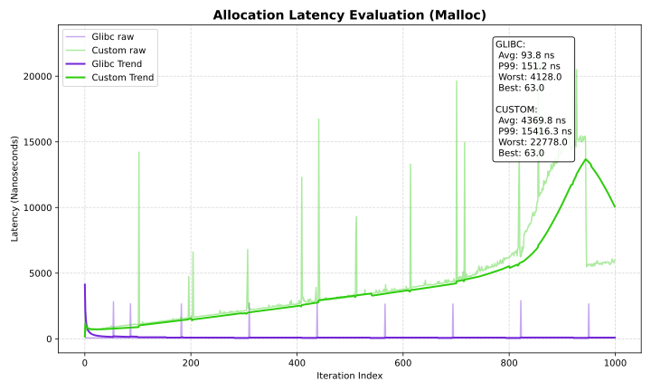
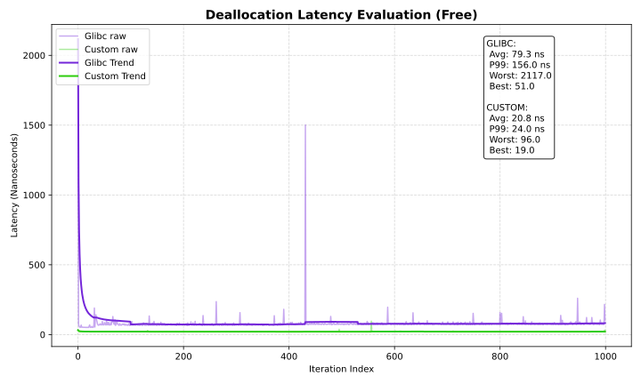
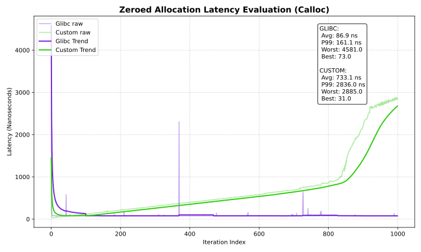
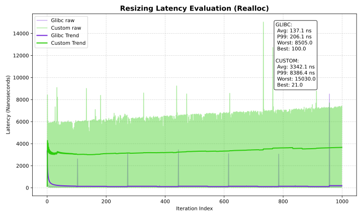

# Custom Memory Allocator (`my_alloc`)

A dynamic memory manager implementing explicit doubly-linked chunk indexing, boundary-tag coalescing, and a hybrid `sbrk()` / `mmap()` allocation strategy.

---

## Table of Contents
- [Core Features](#core-features)
- [Structural & Architectural Overview](#structural--architectural-overview)
- [Getting Started & Compilation](#getting-started--compilation)
- [Performance Benchmarks & Architecture Analysis](#-performance-benchmarks--architecture-analysis)
- [Lessons Learned & Next Steps](#lessons-learned--next-steps)
- [License](#license)

---

## Core Features

This project implements a low-level virtual memory manager designed to handle dynamic allocations directly on the operating system heap, replicating the runtime behavior of standard C library memory management.

* **Hybrid Allocation Paths:** Allocations underneath `128 KiB` utilize the `sbrk()` data segment heap expansion path. Requests $\g$ `128 KiB` automatically pivot to a kernel-space anonymous `mmap()` allocation.
* **Boundary-Tag Coalescing:** Implements immediate $\mathcal{O}(1)$ bidirectional merging (checking both forward and backward contiguous blocks) during deallocation to drastically mitigate memory fragmentation.
* **Metadata Optimization:** Packs payload sizing metrics, allocation states, and mapping types tightly inside a single structure header using explicit bitwise masking flags to preserve structural alignment and cache locality.

---

## Structural & Architectural Overview

The virtual memory heap layout is tracked using a continuous explicit doubly-linked list. Each memory allocation segment is split into an explicit metadata header block and the raw variable data payload given back to the calling process:

```plaintext
┌────────────────────────────────────────────────────────┐
│                      block_t Struct                    │
├───────────────────┬──────────────────┬─────────────────┤
│ size_and_flag     │ *prev            │ *next           │
│ (size + free/mmap)│ (Pointer Back)   │ (Pointer Front) │
├───────────────────┴──────────────────┴─────────────────┤
│ payload data[] (Aligned user space boundary)            │
└────────────────────────────────────────────────────────┘

```

### Allocation Policy: First-Fit Strategy

When `my_malloc()` is invoked, the allocator sets its focus at the global `heap_head` pointer and traverses forward through existing blocks.

1. If a block is flagged as **Free** and its available capacity $\ge$ requested size, it is consumed.
2. If the block has enough structural overhead leftovers, it is dynamically **split** into a smaller active node and a freshly carved trailing free node.
3. If no compatible node is discovered via traversal, the allocator invokes `sbrk()` to safely claim new unmapped territory at the program break.

---

## Getting Started & Compilation

### Prerequisites

A Linux-based kernel environment equipped with `gcc` (or `clang`), `make`, and the `uv` toolchain manager to generate performance plots.

### 1. Build and Run the Test Framework

To compile the framework along with its structural validation stress tests and generate raw telemetry profiles:

```bash
make run
make test

```

This routine validates allocation boundaries, confirms explicit pointer configurations during node splitting, verifies active error mitigation channels, and leaves performance results in `benchmark_results.csv`.

### 2. Render Analytics Reports

Execute the plot compilation scripts using `uv` to process the metrics and generate scalable vector charts:

```bash
make plot

```

---

## Performance Benchmarks & Architecture Analysis

Measurements are compiled from 1,000 distinct allocation, mutation, and deallocation cycles, benchmarked against the production-grade GNU C Library (`glibc`) allocator.

| Metric (ns) | Glibc (Avg) | Custom Alloc (Avg) | Performance Delta | Glibc ($P_{99}$) | Custom ($P_{99}$) |
| --- | --- | --- | --- | --- | --- |
| **`malloc`** | $92.5\text{ ns}$ | $5,003.4\text{ ns}$ | ~54x Slower | $73.9\text{ ns}$ | $11,987.3\text{ ns}$ |
| **`free`** | $73.6\text{ ns}$ | $37.8\text{ ns}$ | **~2x Faster** 🚀 | $100.0\text{ ns}$ | $46.0\text{ ns}$ |
| **`calloc`** | $78.4\text{ ns}$ | $1,611.9\text{ ns}$ | ~20x Slower | $99.0\text{ ns}$ | $2,749.0\text{ ns}$ |
| **`realloc`** | $132.9\text{ ns}$ | $3,957.1\text{ ns}$ | ~30x Slower | $165.4\text{ ns}$ | $11,087.2\text{ ns}$ |

### Detailed Breakdown

#### 1. Allocation Performance (`my_malloc`)



* **Analysis:** `my_malloc` processes requests at an average speed of `5,003.4 ns` compared to Glibc's `92.5 ns`.
* **Architectural Trade-offs:** The disparity stems from the underlying algorithmic layout. Because our allocator uses a basic First-Fit model mapped to a single list, finding an available node requires an $\mathcal{O}(N)$ pointer traversal from `heap_head`. Furthermore, when no reusable block is available, the append strategy traverses the *entire list again* to locate the list tail before extending the program break with `sbrk()`. Glibc circumvents this entirely by utilizing segregated free lists ("bins") mapped via bitmasks to locate optimal size blocks in constant $\mathcal{O}(1)$ time.

#### 2. Deallocation Optimization (`free`)



* **Analysis:** `my_free` registers an exceptional runtime of `37.8 ns`, executing **twice as fast** as Glibc's `73.6 ns`.
* **Architectural Trade-offs:** This optimization highlights the efficiency of the explicit boundary-tag configuration. Because every chunk header maintains explicit bidirectional pointers (`prev` and `next`), the allocator look up raw metadata tags using pointer arithmetic and modifies active bitmasks in strict $\mathcal{O}(1)$ time. Coalescing occurs entirely inline via pointer swaps without searching or structural sorting. Glibc incurs overhead here because it cannot simply leave a freed node inside a unified space; it must route freed segments into tiered caching layers or global bins.

#### 3. Initialization Performance (`my_calloc`)



* **Analysis:** Glibc completes initialization cycles in `78.4 ns` vs our allocator's `1,611.9 ns`.
* **Architectural Trade-offs:** Our `my_calloc` relies on a multi-step routine: it first calls `my_malloc` (inheriting its full linear search traversal costs) and then applies `memset()` across the payload space to zero out memory. Glibc leverages kernel-level optimization flags. When allocating memory through kernel page mappings, the operating system guarantees the fresh virtual frames are pre-zeroed for isolation and security reasons. Glibc identifies this internal state and bypasses the `memset` clearing cycle entirely.

#### 4. Resizing Performance (`my_realloc`)



* **Analysis:** Glibc handles resizing in `132.9 ns` compared to our allocator's `3,957.1 ns`.
* **Architectural Trade-offs:** While our implementation features optimization logic for bidirectional in-place growth (coalescing free neighbor nodes via `has_prev` and `has_next`), it must fall back to a full migration sequence whenever a block is completely locked by surrounding boundaries. This fallback triggers a new `my_malloc` call, a full data migration using `memcpy()`, and a `my_free` call, reintroducing linear search bottlenecks.

---

## Lessons Learned & Next Steps

Developing this custom allocator highlighted the fundamental engineering tensions between tracking overhead simplicity and execution time:

1. **The Cost of First-Fit:** While single explicit lists keep tracking data straightforward, linear search complexities degrade performance as the program size grows.
2. **Segregation is Essential for Scale:** To approach glibc-level speed, the single global chain should be replaced with **Segregated Free Lists (Bins)** or bucket arrays categorized by geometric size spacing, ensuring searches execute in bounded $\mathcal{O}(1)$ constraints.
3. **Optimizing List Extensions:** Maintaining a dedicated global `heap_tail` pointer would eliminate the list traversal overhead required when appending fresh allocations via `sbrk`.

---

## License

This software is distributed under the terms of the MIT License.
